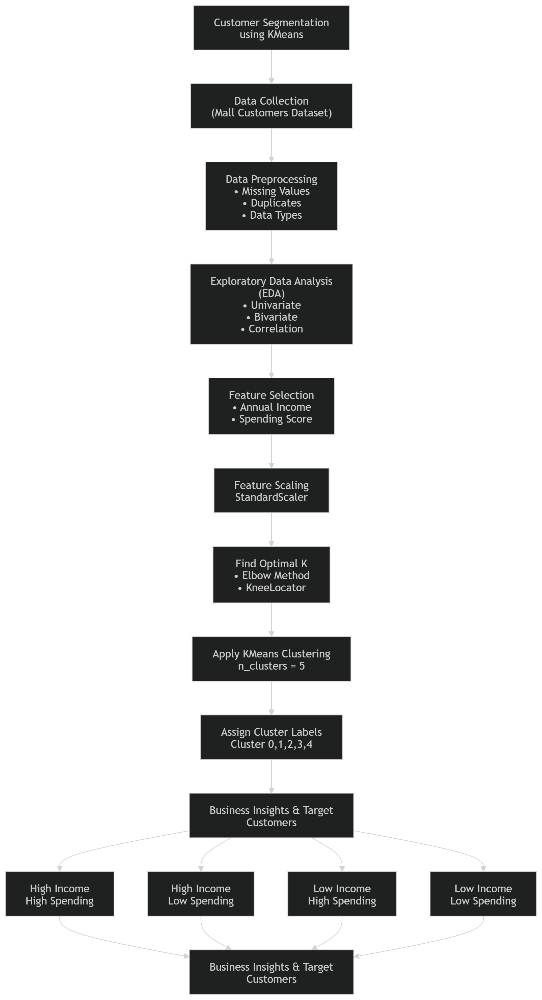

# Customer Segmentation

---

## Problem Statement : 
In business, understanding the customer's purchasing behavior is important in improving the business. Without segmentation, marketing become ineffective.

### The goal of this project is : 
To segment customers into distinct groups based on their annual income and spending behavior using unsupervised machine learning techniques.

### By identifying different customer segments, businesses can:
- Personalize marketing strategies
- mprove customer retention
- Increase profitability

---

## Project Approach
### Step 1: Data Understanding
- Load dataset
- Inspect structure
- Understand features

### Step 2: Data Preprocessing
- Remove irrelevant columns (CustomerID)
- Encode categorical features
- Check for null/duplicate values

### Step 3: Exploratory Data Analysis
- Age distribution
- Income vs Spending patterns

### Step 4: Feature Selection
- Selected:
- Annual Income
- Spending Score

### Step 5: Feature Scaling
- Standardization using StandardScaler

### Step 6: Model Building
- Apply K-Means clustering
- Use Elbow Method to determine optimal K

### Step 7: Evaluation
- Silhouette Score
- Cluster visualization

### Step 8: Business Interpretation
- Label clusters based on spending behavior 

---

## Project Workflow

