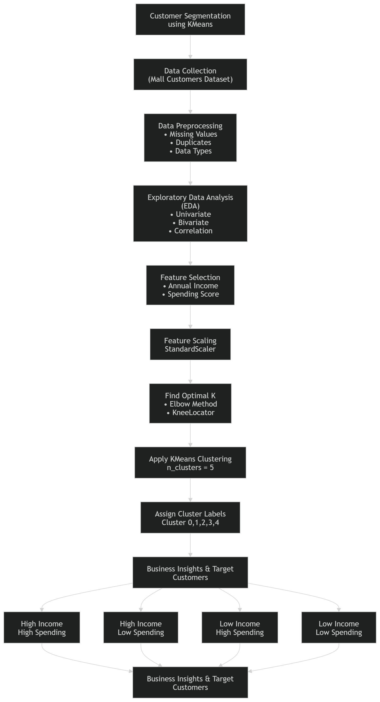

# Customer Segmentation
A machine learning web application that segments customers using K-Means clustering based on income and spending behavior.Built with Streamlit to provide interactive predictions and visual insights for data-driven marketing decisions.
## Live demo :
https://customer-segmentation-p1.streamlit.app/
## Problem Statement : 
The retail industry deals with a large number of customers who have different purchasing behaviors and spending patterns. Without proper segmentation, it becomes difficult for businesses to understand customer needs and design effective marketing strategies. Companies need a way to identify groups of customers with similar characteristics from large datasets. Therefore, a data-driven approach such as clustering can be used to segment customers based on their income and spending behavior to support better business decision-making.

### The Objective of this project is : 
The objective of this project is to perform customer segmentation using machine learning techniques to identify groups of customers with similar spending behavior. By analyzing features such as annual income and spending score, the project aims to divide customers into meaningful clusters. This helps in understanding different customer types and their purchasing patterns. The insights obtained can support businesses in creating targeted marketing strategies and improving customer satisfaction.

### By identifying different customer segments, businesses can:
Personalize marketing strategies for each group of customers. This helps improve customer satisfaction and retention by providing more relevant products and offers. As a result, companies can increase sales and overall profitability.

## Project Approach
The project begins with understanding the dataset by loading it and examining its structure and features. During preprocessing, irrelevant columns such as CustomerID are removed and the dataset is checked for missing or duplicate values to ensure data quality. Exploratory Data Analysis (EDA) is then performed to understand patterns like age distribution and the relationship between annual income and spending score. Based on this analysis, the most relevant features, Annual Income and Spending Score, are selected for clustering. These features are standardized using StandardScaler so that all variables contribute equally to the model. The K-Means clustering algorithm is then applied to segment customers into different groups. The optimal number of clusters is determined using the Elbow Method. Finally, the clusters are evaluated using the Silhouette Score and interpreted to understand different customer spending behaviors.

## Project Workflow

